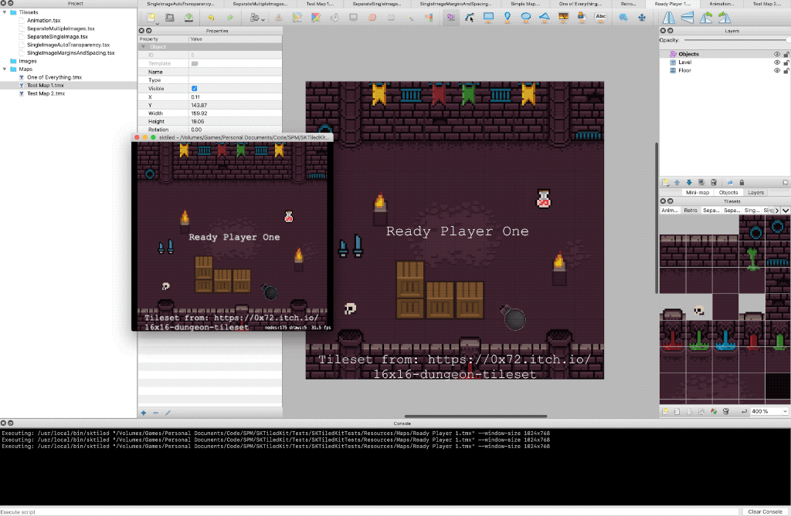

# SKTiledKit

A Swift Package for reading [Tiled](https://www.mapeditor.org) levels that makes it easy to use with [SpriteKit](https://developer.apple.com/documentation/spritekit) and provides a command line utility that provides (amongst other things) the ability to preview levels directly from Tiled. SKTiledKit is build on top of [TiledKit](https://github.com/SwiftStudies/TiledKit) a cross-platform Swift package for reading maps, tilesets and more. 

Out of the box (with no specialisation for your particular game) the only code needed to load a level, playing animations would be

    // The the map from the Maps folder of the app's bundle
    let scene = try Project.default.retrieve(scene: "Level 1", in: "Maps")
    
    // Configure and present the view
    scene.scaleMode = .aspectFill
    let view  = SKView(frame: scene.frame)
    view.presentScene(scene)

You can find more information in the [SKTIledKIt Documentation](Documentation/). You can actually explore this default behaviour using sktiled, a command line utility included in the package that can be configured as a command in tiled. Here's it running, note that debugging of SpriteKit physics objects is turned on so you can see the collision body for the bomb being translated into the generated `SKSprite` node. 

## Documentation

 - [`sk-tiled`](Documentation/sk-tiled.md) More documentation on the command line utility
 - [Documentation](Documentation/) All documentation on how different Tiled entities are used/interpretted

